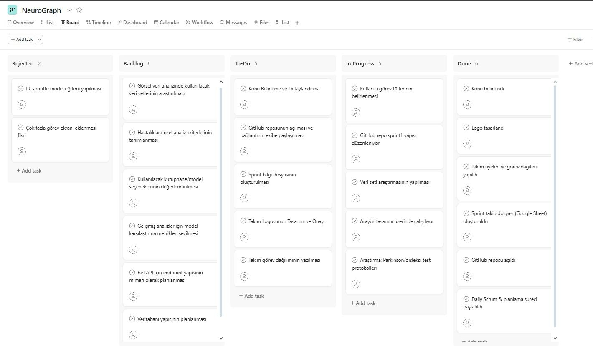
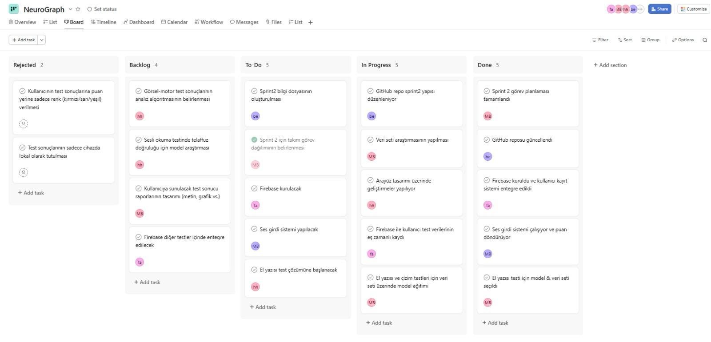
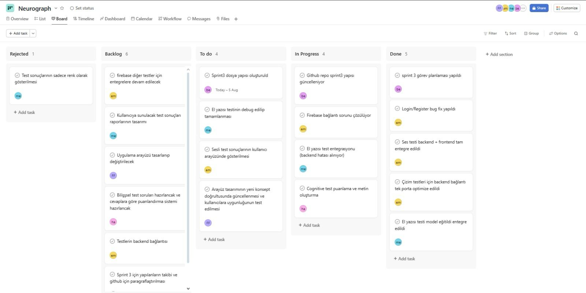
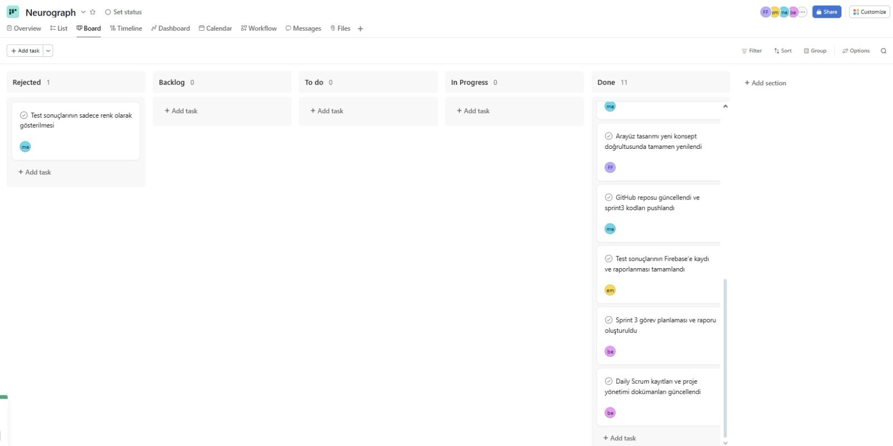
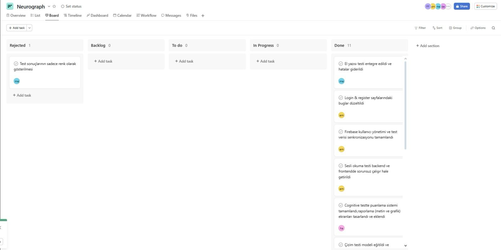

# Takım ve Ürün Adı

**Takım Adı**
- Yapay Zeka ve Veri Bilimi-132- 

**Ürün Adı**
- NeuroGraph

## Takım ve Ürün Hakkında Bilgiler

**Takım Üyeleri**
| İsim                   | Görev          |
|------------------------|----------------|
| Beyza Yaylak          | Scrum Master |
| Melisa Bayramoğlu          | Product Owner  |
| Harun Benli   | Developer      |
| Muhammet Emin Balmuk       | Developer      |
| Fatma Işıl Fidan       | Developer      |

**Ürün Açıklaması**
- NeuroGraph, bilişsel değerlendirme süreçlerini kolaylaştırmak ve kişiselleştirmek amacıyla tasarlanmış yenilikçi bir mobil uygulamadır. Kullanıcılara etkileşimli bir deneyim sunarak temel bilişsel fonksiyonlarını (oryantasyon, hafıza, dikkat, dil ve yürütücü işlevler gibi) kendi hızlarında ve konforlu bir ortamda test etme imkanı sağlar. Uygulama, yapay zeka destekli sorular aracılığıyla kullanıcıdan doğrudan yanıtlar alarak, bu veriler ışığında genel bilişsel durumlarına dair öncü bir değerlendirme raporu sunar.

- NeuroGraph'ın temel amacı, kullanıcıların bilişsel sağlıkları hakkında bilinçlenmelerine yardımcı olmak ve potansiyel güçlü veya zayıf alanları erken aşamada fark etmelerine olanak tanımaktır. Test sonuçları, kesin bir tıbbi tanı koymaktan ziyade, bireysel bilişsel profiller hakkında genel gözlemler ve içgörüler sağlar. Bu sayede kullanıcılar, gerekirse daha ileri tıbbi değerlendirmeler için bir sağlık uzmanına başvurma konusunda bilgiye dayalı kararlar alabilirler.

**Ürün Özellikleri**
- NeuroGraph, kullanıcı dostu ve sezgisel bir arayüz ile tasarlanmıştır. Minimalist ve anlaşılır ekran tasarımları sayesinde her yaştan ve teknoloji okuryazarlığı seviyesinden kullanıcı, uygulamada kolayca gezinebilir ve bilişsel testleri herhangi bir zorluk yaşamadan tamamlayabilir.

- Uygulamanın kalbinde yapay zeka destekli dinamik soru akışı bulunur. Gemini teknolojisi ile entegre olan NeuroGraph, oryantasyon, hafıza (anlık ve gecikmeli hatırlama dahil), dikkat, dil becerileri (cümle dönüştürme gibi karmaşık görevler) ve yürütücü işlevler gibi temel bilişsel alanları kapsayan özelleştirilmiş sorular sunar. Bu dinamik yapı, testin her kullanıcı için adaptif olmasını ve farklı bilişsel fonksiyonları etkili bir şekilde değerlendirmesini sağlar.

- NeuroGraph, tamamlanan testlerin sonunda detaylı ancak anlaşılır bir ön değerlendirme raporu sunar. Bu rapor, kullanıcının bilişsel güçlü ve zayıf alanlarını vurgulayarak genel bir bakış sağlar. Raporlar, kesin tıbbi tanı niteliği taşımamakla birlikte, kullanıcılara bilişsel sağlıkları hakkında bilinçli bir farkındalık kazandırmak ve gerektiğinde profesyonel tıbbi yardım arayışında bulunmaları için yol göstermek amacıyla tasarlanmıştır. Tüm kullanıcı verileri ve test sonuçları, gizlilik ve güvenlik standartlarına uygun şekilde korunur.

  
**Hedef Kitle**
- NeuroGraph'ın hedef kitlesi, bilişsel sağlıklarını proaktif bir şekilde takip etmek isteyen geniş bir yelpazedeki bireylerden oluşmaktadır. Bu kitlenin başında, yaşlanma süreciyle birlikte bilişsel fonksiyonlarında meydana gelebilecek değişiklikler hakkında endişeleri olan veya mevcut durumlarını gözlemlemek isteyen orta yaş ve üzeri yetişkinler gelmektedir. Ayrıca, yoğun iş temposu, stres veya uyku düzeni bozuklukları gibi nedenlerle dikkat, hafıza veya odaklanma sorunları yaşadığını düşünen genç ve orta yaşlı profesyoneller de NeuroGraph'ın potansiyel kullanıcıları arasındadır. Uygulama, herhangi bir ön bilgi veya tıbbi geçmiş gerektirmediği için, bilişsel testlere erişimi olmayan veya ön değerlendirme yapmak isteyen herkes için ideal bir başlangıç noktası sunar. Özetle, NeuroGraph, bilişsel farkındalığını artırmak ve zihinsel sağlık yolculuğunda ilk adımı atmak isteyen herkese hitap eden kapsayıcı bir araçtır.

<h3>Uygulamanın Arayüz Tasarımı</h3>
 
<table>
  <tr>
    <td></td>
    <td></td>
  </tr>
  <tr>
    <td></td>
    <td></td>
  </tr>
  <tr>
    <td></td>
    <td></td>
  </tr>
  <tr>
    <td></td>
    <td></td>
  </tr>
</table>

<h2>Product Backlog</h2>

  

    
     
    
     
    
     
    
     
    
     
    
     
    
     
    
  

  
<h2>Sprint 1</h2>

---

  
<h3>Sprint 1 - App Screenshots</h3>

    

    
     
    
     
    
     
    
     
    
     
    
     
    
     
    
     
    
     
    
     
    
     
    
     
    
     
    
     
    
     
    
  

  
<h3>Sprint 1 - Sprint Board Update Screenshots</h3>

  https://docs.google.com/spreadsheets/d/1Cv6z4U5Twf6dg4QvCqDg6eEn2MUoXFmWakvXuv8ObM0/edit?gid=0#gid=0

- <h3>Sprint Notes</h3>
  İlk sprintte konu belirlendi. Herkesten bir konu istenildi ve bu konuda çalışmaların araştırılması istendi. Genel olarak iyi bir sprint süreci geçirdiğimizi düşünüyoruz. İş tempomuz olsa da zamanı iyi kullandığımızı düşünüyoruz.

- <h3>Tahmin Edilen Puan ve Tamamlanan Puan</h3> 

  - Beklenen: 200 puan

  - Tamamlanan: 200 puan 

- <h3>Puan Tamamlama Mantığı</h3> 
  Ekibin iş yoğunluğu ve okul durumu gibi etkenlere rağmen, görevlerin tamamlanmasına öncelik verildi ve hedeflenen puan eksiksiz şekilde tamamlandı. Süreç boyunca planlamaya sadık kalınarak görev dağılımları yapıldı ve ortaya çıkan aksaklıklar ekip içi iletişimle giderildi.
- <h3>Daily Scrum</h3>
   
  

    
     
     
    
     
     
    
     
     
    
  

   
   
  Ekip olarak yeni bir ürün fikri geliştirmek amacıyla işe koyulduk ve ilk adım olarak tüm ekip üyelerinin fikir üretip paylaşabileceği bir ortam oluşturduk.  
  Bu süreç için belirli bir zaman sınırı belirlendi ve Beyza Yaylak, Melisa Bayramoğlu, Harun Benli, Muhammet Emin Balmuk ve Fatma Işıl Fidan kendi fikirlerini ekip ile paylaştı.  

  Sunulan fikirler, sadece yaratıcılık açısından değil; aynı zamanda uygulanabilirlik, zaman yönetimi ve hedefe uygunluk bakımından detaylı şekilde değerlendirildi. Bu değerlendirmelere ek olarak, paydaşlarla yapılan toplantılarda da fikirlerin potansiyeli üzerine görüşler alındı.  
  Tüm değerlendirmeler sonucunda Melisa Bayramoğlu’nun fikrinin geliştirilmesine karar verildi.**  

  Fikir netleştikten sonra tasarım sürecine geçildi ve Beyza Yaylak ile Muhammet Emin Balmuk iki farklı logo tasarımı hazırladı. Yapılan değerlendirme sonucunda Emin’in tasarımı ekip tarafından seçildi ve ürün logosu olarak belirlendi.

  Bu kararın ardından proje için ilk sprint süreci başlatıldı ve ekip planlanan görevleri zamanında tamamladı.  
  Sprint boyunca ürünün temel yapısını oluşturan kodlama kısmına odaklanıldı. Özellikle giriş ekranı ve ana sayfa gibi temel kullanıcı arayüzleri tasarlanıp geliştirme aşamasına alındı.  
  Tüm ekip üyeleri ortak bir hedef doğrultusunda uyumlu bir şekilde çalıştı.

- <h3>Product Backlog URL</h3> 

  
  

  

- <h3>Sprint Review</h3>  
  Ürün değerlendirme sürecinde ekip olarak proje seçimi konusunda herhangi bir zorluk yaşanmadı. Fikirlerin netliği ve ekip içi uyum sayesinde karar süreci hızlı bir şekilde tamamlandı.  
  Melisa Bayramoğlu, projenin yapım aşamasında gösterdiği ekstra çaba ile projenin sürdürülebilirliğine büyük katkı sağladı.  

  Proje isminin Türkçe mi yoksa İngilizce mi olması gerektiği üzerine bir süre düşünülse de, sonunda daha evrensel bir etki yaratmak amacıyla İngilizce olmasına karar verildi.  

  Bu sprint sürecindeki en büyük zorluk ise projenin temelini oturtmak oldu. Teknik yapıların planlanması ve ekip üyelerinin görevlerine adapte olması beklenenden uzun sürdü. Özellikle ekipteki kişilerin iş ve okul yoğunluğu, proje başlangıcını geciktiren temel etkenlerden biri oldu.  
  Tüm bu aksaklıklara rağmen ekip uyumu ve kararlılığı sayesinde proje adım adım ilerlemeye devam etti.

- <h3>Sprint Review Participants</h3>
  
  - Beyza Yaylak  
  - Melisa Bayramoğlu  
  - Harun Benli  
  - Muhammet Emin Balmuk  
  - Fatma Işıl Fidan

- <h3>Sprint Retrospective</h3>

  **Neler iyi gitti?**
  - İkinci sprintte uygulamaya yoğunlaşılmasına karar verildi.  
  - Takım içi iletişim güçlüydü.  
  - Görevler zamanında tamamlandı.  
  - Planlama toplantısı verimli geçti.  
  - Kod gözden geçirme süreci etkiliydi.  

  **Neler iyileştirilmeli?**
  - Bazı görevlerin tanımı yeterince net değildi.  

  **Gelecek Sprint İçin Aksiyonlar**
  - Görev açıklamaları daha ayrıntılı yazılacak.

  
<h2>Sprint 2</h2>

---

  
<h3>Sprint 2 - App Screenshots</h3>

    

    
     
    
     
    
     
    
     
    
     
    
     
    
     
    
     
    
     
    
     
    
     
    
     
    
     
    
     
    
     
    
  

  
<h3>Sprint 2 - Sprint Board Update Screenshots</h3>

  https://docs.google.com/spreadsheets/d/1Cv6z4U5Twf6dg4QvCqDg6eEn2MUoXFmWakvXuv8ObM0/edit?gid=0#gid=0

- <h3>Sprint Notes</h3>
  İkinci sprintte ürün geliştirme sürecinde daha teknik ve fonksiyonel adımlara geçildi. Özellikle test altyapılarının kurulması, kullanıcı kimlik doğrulama sisteminin entegre edilmesi ve yapay zekâ destekli test sistemlerinin oluşturulması bu sprintin ana hedefleri arasında yer aldı. Ekip üyeleri, görev dağılımı ve zaman planlamasına sadık kalarak başarılı bir sprint süreci yürüttü.

- <h3>Tahmin Edilen Puan ve Tamamlanan Puan</h3> 

  - Beklenen: 500 puan

  - Tamamlanan: 500 puan 

- <h3>Puan Tamamlama Mantığı</h3> 
  İkinci sprintte toplam 500 puanlık bir hedef belirlenmesinin temel nedeni, ekibin ilk sprintte gösterdiği yüksek performans ve hızlı adaptasyon oldu. İlk sprint sonunda ekip üyeleri hem birbirine alıştı hem de proje yapısına hâkimiyet kazandı. Bu sayede görev dağılımı daha net yapılabildi ve iş akışı daha verimli ilerledi. 

  Takım üyeleri arasındaki iletişim ve koordinasyon önemli ölçüde güçlendi. Görevlerin zamanında teslim edilmesi, teknik problemlere birlikte çözüm aranması ve sorumluluk bilinciyle hareket edilmesi, yüksek puanlı bir sprint planlamasını mümkün kıldı.

  Bu sprintte hem frontend hem backend tarafında yoğun geliştirmeler yapıldığı, API entegrasyonları, test ekranları, veritabanı yapıları ve güvenlik sistemleri üzerinde çalışıldığı göz önüne alındığında; 500 puanlık hedef, sprintin kapsamına uygun ve gerçekçi bir hedef olarak belirlendi. Tüm görevler eksiksiz şekilde tamamlandı.

- <h3>Daily Scrum</h3>
   
  

    
     
     
    
     
     
    
     
     
    
     
     
    
  

   
   
  Sprint 2 sürecinde ekip olarak ürünün işlevsel yönlerini geliştirmeye odaklandık. İlk sprintte temeli atılan yapının üzerine, bu kez kullanıcı etkileşimini sağlayacak sistemler ve test altyapıları inşa edilmeye başlandı. Her ekip üyesi, görev dağılımına uygun şekilde sorumluluklarını yerine getirdi ve teknik gelişmeler adım adım ilerletildi.

  Sprintin başında, uygulamanın kullanıcı giriş güvenliğini sağlamak amacıyla kimlik doğrulama sisteminin kurulmasına öncelik verildi. Fatma Işıl Fidan tarafından Firebase Authentication entegrasyonu gerçekleştirildi. Bu sayede kullanıcıların e-posta ve şifreyle güvenli şekilde giriş yapmaları sağlandı. Oturum açmış kullanıcıların uygulamayı yeniden açtıklarında otomatik olarak ana sayfaya yönlendirilmeleri sağlanarak kullanıcı deneyimi geliştirildi.

  Cognitive test ekranı, Melisa Bayramoğlu tarafından oluşturuldu. Melisa, bu bölümde kullanılan soruların MMSE (Mini Mental State Examination) ve MoCA (Montreal Cognitive Assessment) testlerinden uyarlanarak hazırlandığını belirtti. cognitive_test.dart dosyasında geliştirilen arayüz üzerinden kullanıcıya Gemini API aracılığıyla dinamik sorular sunulmakta ve kullanıcı cevapları toplanmaktadır. API’nin puanlaması ve değerlendirme çıktıları, Firebase Firestore veritabanına, kullanıcıların benzersiz UID’leri altında düzenli şekilde kaydedilmektedir.

  Ayrıca Melisa, testin yalnızca doğru cevap odaklı olmaması gerektiğini; özellikle metin okuma testinde ses tonu, vurgu ve konuşma ritmi gibi faktörlerin de değerlendirilmesi gerektiğini ifade etti. Bu doğrultuda ses analizi özellikleri ileriki sprintlerde test sistemine entegre edilecektir.

  Muhammet Emin Balmuk, kısa metin anlatımı ve detaylı paragraf okuma testlerinin backend altyapısını oluşturdu. Giriş ekranına dair sunucu taraflı kodlamalar ve kullanıcı yönlendirme mekanizmaları da bu sprintte başarıyla tamamlandı.

  Fatma Işıl Fidan, Firebase Authentication dışında, test sonuçlarının güvenli ve doğru şekilde veritabanına aktarılmasını sağladı. Ayrıca çizim testlerine yönelik el yazısı verileriyle çalışan makine öğrenmesi modelleri eğitildi ve prototip süreci başlatıldı.

  Harun Benli, testlerin bilimsel altyapısı konusunda destek sağladı. MMSE ve MoCA test yapılarına yönelik içerik araştırmaları yaparak, kullanılabilecek soru formatlarının oluşturulmasına katkıda bulundu.

  Sprint boyunca tüm bu süreçlerin takibi, dökümantasyonu ve toplantı planlamaları Beyza Yaylak tarafından yürütüldü. Ekip içi koordinasyon sağlandı, ilerlemeler gözlemlendi ve günlük görev takibi titizlikle sürdürüldü.

  Sprint 2, ürünün teknik altyapısının derinleştirildiği ve kullanıcı deneyimi boyutunun güçlendirildiği bir dönem olarak başarıyla tamamlandı.

- <h3>Product Backlog URL</h3> 

  
  

  

- <h3>Sprint Review</h3>  
  Sprint sonunda ekip, gerçekleştirilen tüm görevleri gözden geçirdi ve test sistemlerinin çalışır durumda olduğu doğrulandı. Giriş sistemi, test ekranları ve veri kaydetme yapısı başarıyla çalıştı.
  Gemini API’den alınan veriler üzerinden yapılan dinamik soru-cevap işlemleri düzgün çalıştı. Firebase sisteminde veri kayıtları incelendi ve test sonuçlarının doğru şekilde aktarıldığı görüldü.

- <h3>Sprint Review Participants</h3>
  
  - Beyza Yaylak  
  - Melisa Bayramoğlu  
  - Harun Benli  
  - Muhammet Emin Balmuk  
  - Fatma Işıl Fidan

- <h3>Sprint Retrospective</h3>

  **Neler iyi gitti?**
  - Firebase Authentication başarılı şekilde entegre edildi.
  - Gemini API ile test sistemi entegre edildi.
  - Test sonuçlarının otomatik ve kullanıcı bazlı olarak veritabanına kaydedilmesi sağlandı.
  - Takım içi iletişim güçlüydü ve görev dağılımı dengeliydi.
  - Belirlenen sürede hedeflenen görevler tamamlandı.

  **Neler iyileştirilmeli?**
  - Bazı görevlerde teknik detaylara daha fazla yer verilmesi gerekiyor.
  - Test sonrası değerlendirme sonuçlarının daha kullanıcı dostu şekilde sunulması planlanmalı.

  **Gelecek Sprint İçin Aksiyonlar**
  - Kullanıcı arayüzlerinin sadeleştirilmesi ve kullanıcı deneyiminin iyileştirilmesi.
  - Çizim testlerinin tamamlanarak sisteme entegre edilmesi.
  - MMSE ve MoCA sorularının uygulamaya eklenip test edilmesi.

  
<h2>Sprint 3</h2>

---

  
<h3>Sprint 3 - App Screenshots</h3>

<table>
  <tr>
    <td></td>
    <td></td>
  </tr>
  <tr>
    <td></td>
    <td></td>
  </tr>
  <tr>
    <td></td>
    <td></td>
  </tr>
  <tr>
    <td></td>
    <td></td>
  </tr>
</table>

  
<h3>Sprint 3 - Sprint Board Update Screenshots</h3>

  

    https://docs.google.com/spreadsheets/d/1Cv6z4U5Twf6dg4QvCqDg6eEn2MUoXFmWakvXuv8ObM0/edit?gid=0#gid=0
  

- <h3>Sprint Notes</h3>
  Sprint 3 süreci, projenin teknik altyapısının sağlamlaştırıldığı ve kullanıcıya sunulacak tüm test sistemlerinin işlevsel hale getirildiği bir dönemi temsil etmektedir. Önceki sprintlerde tamamlanan temel yapıların üzerine; artık kullanıcı arayüzü tamamlanmış, testlerin otomatik değerlendirme süreçleri çalışır hale getirilmiş ve uygulamanın kullanıcı odaklı tüm bölümleri neredeyse tamamlanmıştır.

Bu sprintte ekip, yalnızca geliştirme değil aynı zamanda kullanıcı deneyimini artırmaya yönelik birçok önemli adım atmıştır. Ekranlar tamamlanmış, sesli-sözel test yapıları çalıştırılmış, yapay zekâ (LLM) destekli analiz süreçleri başarıyla devreye alınmıştır. Ekip başarılı bir şekilde projeyi tamamlamıştır.

- <h3>Tahmin Edilen Puan ve Tamamlanan Puan</h3> 

  - Beklenen: 500 puan

  - Tamamlanan: 500 puan 

- <h3>Puan Tamamlama Mantığı</h3> 
  İkinci sprint sonunda da ekip uyumu üst seviyeye ulaşmıştı. Görevler net biçimde dağılmış, iletişim ve teknik destek ihtiyaçları hızlıca karşılanmıştı. Bu sinerjiyi sürdürebilmek adına Sprint 3 için yine 500 puanlık görev hedefi belirlendi.

Sprint süresince hem frontend (arayüz), hem backend (sunucu taraflı işleyiş) hem de test mantığı gibi çok yönlü geliştirmeler yürütüldü. Bu çapta bir ilerleme için 500 puanlık tahmin yerinde oldu ve ekip bu hedefi başarıyla tamamladı. Proje başarılı bir şekilde tamamlandı.

- <h3>Daily Scrum</h3>
   
  

    
     
     
    
     
     
    
     
     
    
  

   
   
  Fatma Işıl Fidan, onboarding ekranı, login sayfası ve ana sayfa (homepage) arayüzlerini tasarlayıp uygulamaya entegre etti. Kullanıcı deneyimi odaklı, sade ve anlaşılır bir yapı oluşturdu.

Melisa Bayramoğlu, uygulamanın geri kalan tüm ekranlarının kullanıcı arayüz tasarımlarını gerçekleştirdi. Görsel bütünlüğü sağladı, kullanıcı akışlarını optimize etti ve ses tonu gibi detayları değerlendirmeye dahil etme fikrini önerdi.

Harun Benli, cognitive test ekranının işlevsel yapısını geliştirdi. MMSE ve MoCA temelli 10 sözel soru hazırladı. Kullanıcı yanıtlarını LLM ile analiz ederek kişiselleştirilmiş rapor sistemini oluşturdu.

Muhammet Emin Balmuk, kullanıcı yetkilendirme (authorization) işlemleri için backend altyapısını kurdu. Test modüllerinin sunucu taraflı veri işleyişini yapılandırdı ve LLM entegrasyonunun API bağlantılarını yönetti.

Beyza Yaylak, tüm sprint boyunca toplantı planlamalarını organize etti, süreç takibini ve görev koordinasyonunu sağladı. Günlük durum kontrollerini yaptı, sprint dokümantasyonlarını hazırladı ve projenin zamanında ilerlemesini sağladı.

- <h3>Product Backlog URL</h3>
 
https://app.asana.com/1/1117726919553654/project/1210954592726356
 
  

    
     
    
     
    
  

  

- <h3>Sprint Review</h3>  
  Sprint sonunda geliştirilen cognitive test ekranı ve kullanıcı arayüzleri test edildi. LLM tabanlı değerlendirme sisteminin başarılı bir şekilde çalıştığı gözlemlendi. Uygulama artık kullanıcıdan aldığı açık uçlu cevapları analiz edebilmekte ve bunları anlamlı geri bildirimlerle raporlayabilmektedir.

Kullanıcı deneyimi tarafında da olumlu geri bildirimler alındı. UI tasarımlarının tamamlanmasıyla birlikte uygulama bütünsel bir yapıya kavuştu. Testlerin işlevsel altyapısı ve ekranların kullanıma uygunluğu doğrulandı.

- <h3>Sprint Review Participants</h3>
  
  - Beyza Yaylak  
  - Melisa Bayramoğlu  
  - Harun Benli  
  - Muhammet Emin Balmuk  
  - Fatma Işıl Fidan

- <h3>Sprint Retrospective</h3>
Yarışma başlangıcında belirlenen tüm hedefler ve önceki sprintlerde planlanan işlevler eksiksiz bir şekilde hayata geçirildi; proje, planlanan kapsam doğrultusunda başarıyla tamamlandı.

  **Neler iyi gitti?**
- Ekip içi iletişim ve iş birliği güçlüydü. Görevler zamanında tamamlandı ve ekip üyeleri arasında sürekli bilgi paylaşımı sağlandı.

- Kullanıcı arayüz tasarımları planlandığı şekilde tamamlandı. Tüm ekranlar tutarlı bir görsel yapı ve kullanıcı dostu tasarım ilkelerine uygun şekilde oluşturuldu.

- Cognitive test sistemi başarıyla çalıştırıldı. Sorular ve değerlendirme süreci uygulamaya entegre edildi.

- Yapay zekâ destekli (LLM) analiz sistemi sorunsuz şekilde uygulamaya entegre edildi. Kullanıcılardan alınan yanıtlar otomatik olarak değerlendirildi ve raporlandı.

- Backend ve frontend arasında güçlü bir entegrasyon sağlandı. Veri akışı kesintisiz gerçekleşti.

- Toplantı planlamaları ve süreç takibi düzenli şekilde yürütüldü. Proje yönetimi iş planına uygun şekilde sürdürüldü.

- Sprint hedefleri eksiksiz tamamlandı. Tüm görevler planlanan sürede bitirildi, puan hedefi tam olarak karşılandı.

  **Neler iyileştirilmeli?**
  - Proje başarılı bir şekilde tamamlandığı için iyileştirilmesi gereken bir şey kalmadı.

