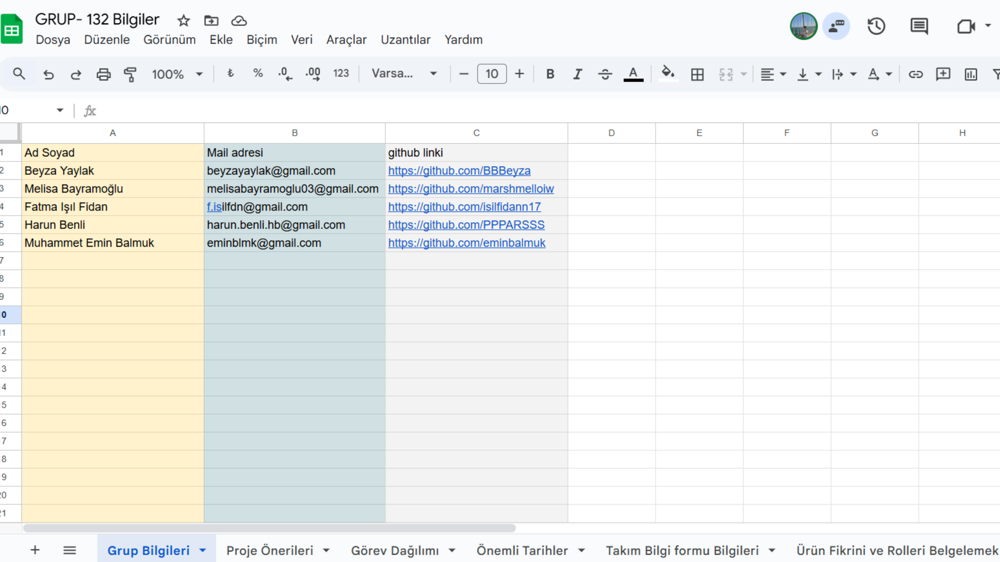
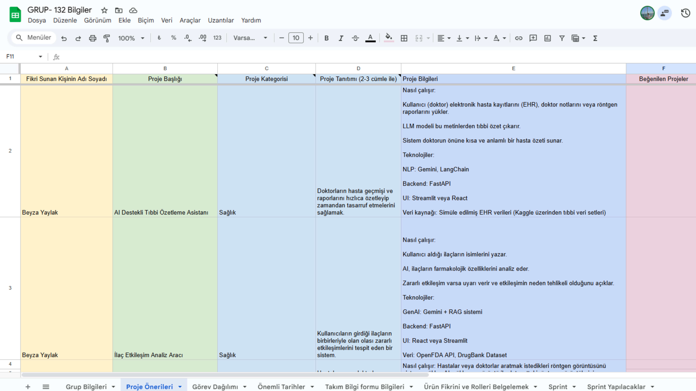
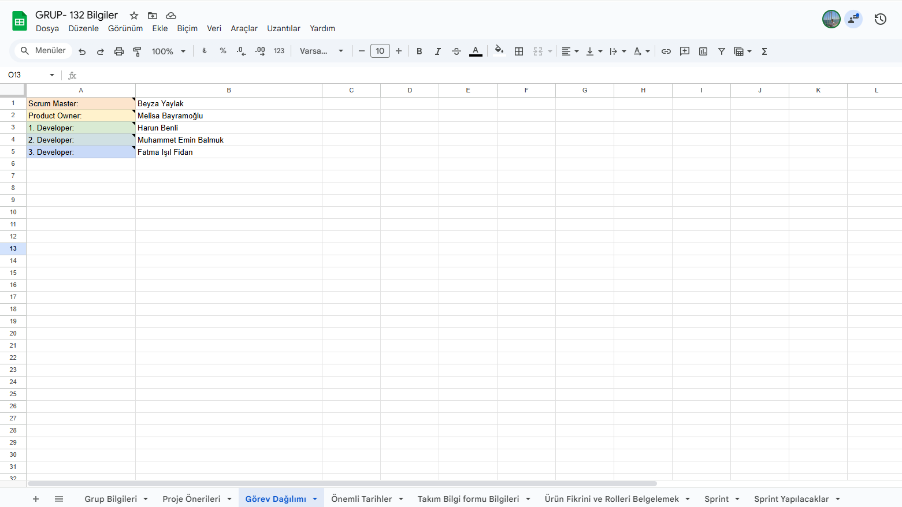
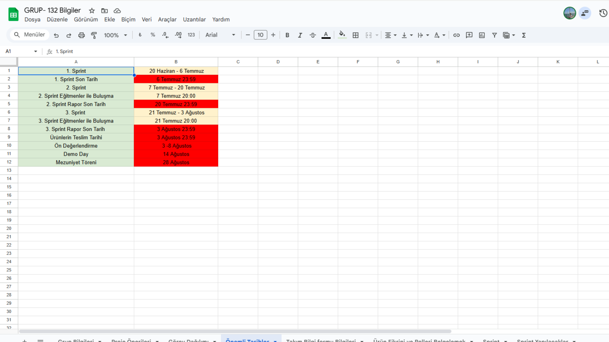
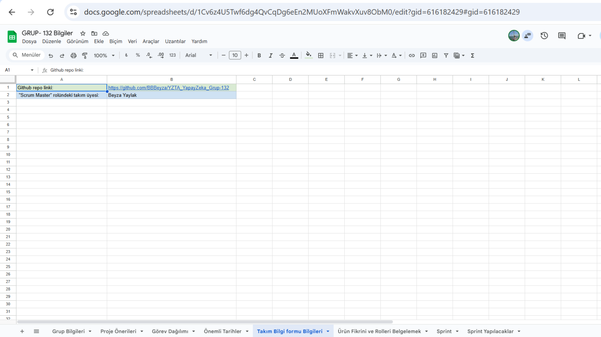
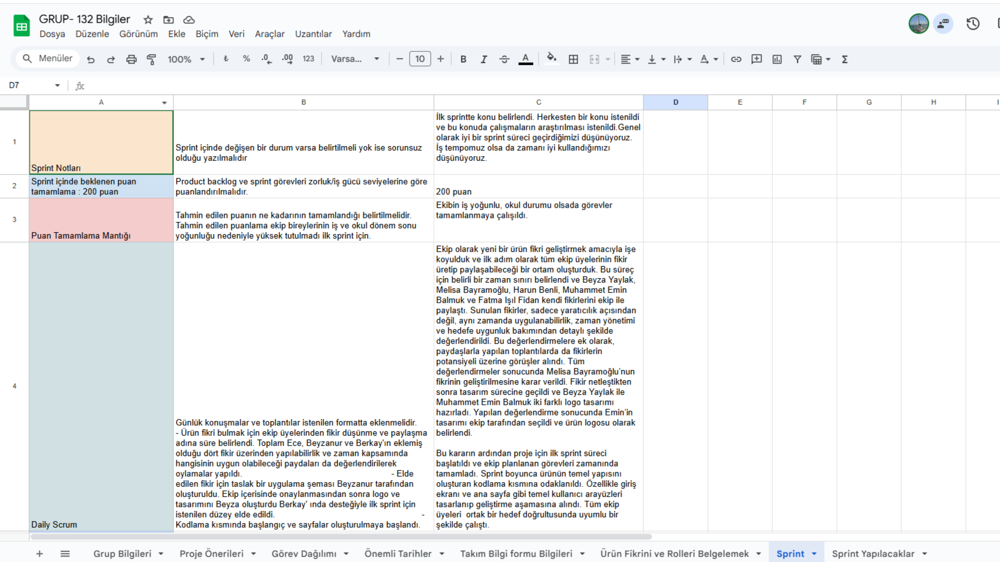
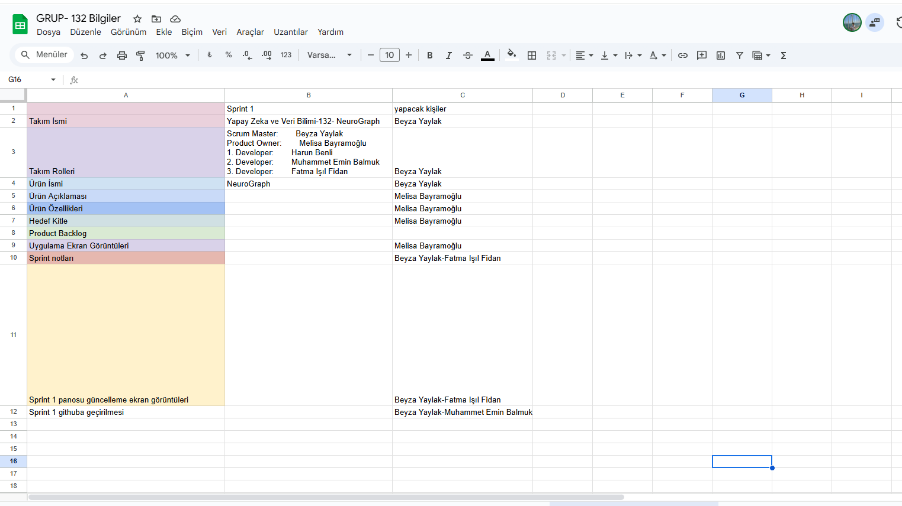
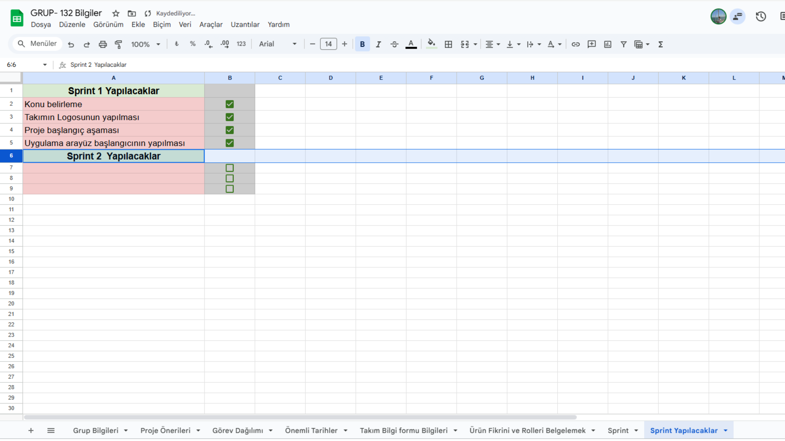

# Takım ve Ürün Adı

Yapay Zeka ve Veri Bilimi-132- NeuroGraph

## Takım ve Ürün Hakkında Bilgiler

**Takım Üyeleri**
| Name                   | Title          |
|------------------------|----------------|
| Beyza Yaylak          | Scrum Master |
| Melisa Bayramoğlu          | Product Owner  |
| Harun Benli   | Developer      |
| Muhammet Emin Balmuk       | Developer      |
| Fatma Işıl Fidan       | Developer      |

## Product Backlog
  

    
     
    
     
    
     
    
     
    
     
    
     
    
     
    
  

  
<h3>Sprint 1</h3>

---

  
<strong>Sprint 1 - App Screenshots</strong>

  
<strong>Sprint 1 - Sprint Board Update Screenshots</strong>

- **Sprint Notes**:  
  İlk sprintte konu belirlendi. Herkesten bir konu istenildi ve bu konuda çalışmaların araştırılması istendi. Genel olarak iyi bir sprint süreci geçirdiğimizi düşünüyoruz. İş tempomuz olsa da zamanı iyi kullandığımızı düşünüyoruz.

- **Sprint içinde beklenen puan tamamlama**:  
  **200 puan**

- **Puan Tamamlama Mantığı**:  
  `(200 points completed)`  
  Ekibin iş yoğunluğu ve okul durumu olsa da görevler tamamlanmaya çalışıldı.

- **Daily Scrum**:  
  Ekip olarak yeni bir ürün fikri geliştirmek amacıyla işe koyulduk ve ilk adım olarak tüm ekip üyelerinin fikir üretip paylaşabileceği bir ortam oluşturduk.  
  Bu süreç için belirli bir zaman sınırı belirlendi ve Beyza Yaylak, Melisa Bayramoğlu, Harun Benli, Muhammet Emin Balmuk ve Fatma Işıl Fidan kendi fikirlerini ekip ile paylaştı.  

  Sunulan fikirler, sadece yaratıcılık açısından değil; aynı zamanda uygulanabilirlik, zaman yönetimi ve hedefe uygunluk bakımından detaylı şekilde değerlendirildi. Bu değerlendirmelere ek olarak, paydaşlarla yapılan toplantılarda da fikirlerin potansiyeli üzerine görüşler alındı.  
  Tüm değerlendirmeler sonucunda Melisa Bayramoğlu’nun fikrinin geliştirilmesine karar verildi.**  

  Fikir netleştikten sonra tasarım sürecine geçildi ve Beyza Yaylak ile Muhammet Emin Balmuk iki farklı logo tasarımı hazırladı. Yapılan değerlendirme sonucunda Emin’in tasarımı ekip tarafından seçildi ve ürün logosu olarak belirlendi.

  Bu kararın ardından proje için ilk sprint süreci başlatıldı ve ekip planlanan görevleri zamanında tamamladı.  
  Sprint boyunca ürünün temel yapısını oluşturan kodlama kısmına odaklanıldı. Özellikle giriş ekranı ve ana sayfa gibi temel kullanıcı arayüzleri tasarlanıp geliştirme aşamasına alındı.  
  Tüm ekip üyeleri ortak bir hedef doğrultusunda uyumlu bir şekilde çalıştı.

- **Product Backlog URL**:  
  _(Link)_

- **Sprint Review**:  
  Ürün değerlendirme sürecinde ekip olarak proje seçimi konusunda herhangi bir zorluk yaşanmadı. Fikirlerin netliği ve ekip içi uyum sayesinde karar süreci hızlı bir şekilde tamamlandı.  
  Melisa Bayramoğlu, projenin yapım aşamasında gösterdiği ekstra çaba ile projenin sürdürülebilirliğine büyük katkı sağladı.  

  Proje isminin Türkçe mi yoksa İngilizce mi olması gerektiği üzerine bir süre düşünülse de, sonunda daha evrensel bir etki yaratmak amacıyla İngilizce olmasına karar verildi.  

  Bu sprint sürecindeki en büyük zorluk ise projenin temelini oturtmak oldu. Teknik yapıların planlanması ve ekip üyelerinin görevlerine adapte olması beklenenden uzun sürdü. Özellikle ekipteki kişilerin iş ve okul yoğunluğu, proje başlangıcını geciktiren temel etkenlerden biri oldu.  
  Tüm bu aksaklıklara rağmen ekip uyumu ve kararlılığı sayesinde proje adım adım ilerlemeye devam etti.

- **Sprint Review Participants**:  
  - Beyza Yaylak  
  - Melisa Bayramoğlu  
  - Harun Benli  
  - Muhammet Emin Balmuk  
  - Fatma Işıl Fidan

- **Sprint Retrospective**:  
  **Neler iyi gitti?**
  - İkinci sprintte uygulamaya yoğunlaşılmasına karar verildi.  
  - Takım içi iletişim güçlüydü.  
  - Görevler zamanında tamamlandı.  
  - Planlama toplantısı verimli geçti.  
  - Kod gözden geçirme süreci etkiliydi.  

  **Neler iyileştirilmeli?**
  - Bazı görevlerin tanımı yeterince net değildi.  

  **Gelecek Sprint İçin Aksiyonlar**
  - Görev açıklamaları daha ayrıntılı yazılacak.

